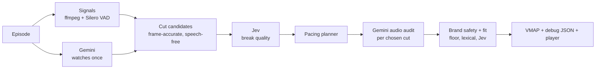

# Context-Aware Ad Break Planner

**hoichoi Hackathon '26 · Problem 1: Context-Aware Video Segmentation & Intelligent Ad Placement**

**Live demo:** https://web-production-6b4b9.up.railway.app

A long-form Bengali episode goes in. Out come semantically coherent scenes, ad breaks placed only at natural,
speech-free moments, a contextually matched brand creative for every break, an **IAB VMAP 1.0 manifest**, a
debug JSON that explains every decision, and a player that actually cuts to the ad and resumes.

---

## Try the demo (3 minutes)

1. **Pick an episode** in the top bar. The timeline shows Gemini's scenes (top band), every cut Jev scored
   (bottom ticks) and the chosen breaks (pink). Hover anything for details.
2. **Press "Preview" on a break card.** Playback jumps to 8 s before the break, cuts to the brand's creative,
   and resumes the episode.
3. **Add a brand.** Paste a brand in the same schema as `brands.json` (a 9th brand is pre-filled) and press
   *Add brand & re-match*. No code changes; the new brand wins wherever it fits best and is blocked wherever its
   negative contexts appear.
4. **Process a new episode.** Paste a Google Drive / direct `.mp4` link or upload a file (up to 40 min, one at a
   time). Processing takes about 2–5 minutes and the log streams live.
5. **Re-run AI analysis** throws away the cached scene notes and judgments for the current episode and redoes them
   live, to show nothing is pre-baked.
6. **VMAP manifest** and **Debug JSON** open the outputs for the current episode.

---

## How it works: Gemini perceives, Jev decides, code enforces



| Model | Role | Why it fits |
|---|---|---|
| **Gemini 3.8 Flash** | Watches and listens to the whole episode once and writes structured English scene notes: location, characters, dominant activity, mood, how each scene opens and ends, open-vocabulary tags, sensitive themes. Later listens to a 10 s clip around each chosen cut. | Native video + audio understanding, including Bengali dialogue. |
| **Jev** (TypeSafe System One) | Answers narrow typed questions over those notes with calibrated probabilities: how natural a break feels (Score 0–3), does the same conversation continue (Noul), is this an emotional peak (Noul), is any of a brand's negative contexts present (Noul), how well the brand fits (Score 0–3). | Calibrated probabilities make thresholds meaningful; about 20 small judgments per break cost almost nothing. |
| **Code** | Shot cuts, fades to black and speech detection; pacing rules; hard blocks; manifest generation. | Deterministic rules stay deterministic. |

### Where: is this a natural, non-jarring cut?

- Gemini's scene boundaries are ~1 s accurate, so they only nominate a *region*. Code then picks the exact cut
  inside it, preferring a **fade to black**, then a **hard shot change**, then the middle of a long pause.
- A cut is only allowed where the speech detector (Silero VAD, per frame) finds **no plausible speech within
  0.35 s on either side**. Boundaries where dialogue runs across the whole region are rejected, never cut.
- Before a break is kept, **Gemini listens to 10 s around the cut**. If it hears anyone mid-sentence, the break
  moves to the next clean cut at that boundary, or is dropped. This catches dialogue buried under music.

### Whether: is a break warranted, given pacing rules?

| Rule | Value |
|---|---|
| Max breaks | 6 per hour, rounded to the runtime (e.g. 2 for a 20-min episode) |
| Min gap between breaks | 240 s |
| Max ad load | 6 % of runtime, counted in real creative seconds |
| Protected zones | No break in the first 120 s or the last 60 s |

Jev's judgments combine into a break quality score. A planner then chooses the set of breaks that maximises total
quality while spreading them evenly, under the rules above. Each break gets a 15/20/30 s creative from the
brand's own catalogue entry: 20 s by default, shorter when ad load is tight, 30 s only at the most natural breaks.

### What: which brand's creative belongs in this slot?

Negative contexts are a **hard block, not a penalty**. Three independent layers; any one of them blocks:

1. **Platform floor:** no brand runs next to sexual content or illegal drugs (keyword evidence or Jev ≥ 0.25).
2. **Lexical evidence:** a brand's negative context (or a synonym, e.g. *grief* → mourning, wailing) appears in
   the scene notes' tags, activity, location or themes.
3. **Jev:** probability ≥ 0.25 that a negative context is shown or discussed.

Evidence is the scene before the break plus the **opening** of the scene after it, not the whole episode, so a
dark storyline does not block a harmless tea-stall scene. Among unblocked brands, **Jev's fit score for the
scene's dominant activity** picks the winner. If no catalogue brand is both safe and relevant, the break does not
survive and the planner re-plans with the next-best moment.

---

## Outputs

| Output | Contents |
|---|---|
| `out/<episode>/vmap.xml` | IAB VMAP 1.0 with inline VAST 3.0: one linear mid-roll `AdBreak` per break, `MediaFile` pointing at the catalogue creative (`id`, `url`, `duration_sec`). Validated as well-formed XML before it is written. |
| `out/<episode>/result.json` | The debug JSON. Every break carries a `trace` with its **where / whether / what** evidence and numbers; every rejected boundary and candidate carries the reason it was rejected; the full brand table (probabilities, fit, which layer blocked what) for each break. |
| `out/<episode>/analysis.json` | Gemini's scene notes (cached). |

---

## Results on the six sample episodes

| Episode | Length | Scenes | Clean cut candidates | Breaks | Ad load | Placements |
|---|---|---|---|---|---|---|
| Bhojon Bilashi | 20 min | 16 | 8 | 2 | 4.1 % | Travel brand after the hosts meet at the river pavilion; food brand during the cooking and dish-guessing game |
| Feluda | 26 min | 15 | 11 | 2 | 3.3 % | Travel brand after "discussing vacation plans" (fit 2.98/3) and after a shikara ride on Dal Lake |
| Indubala Bhaater Hotel | 26 min | 26 | 19 | 2 | 3.9 % | Telecom brand after Indubala's video call with her son; food brand after grinding taro root |
| Mandaar | 39 min | 27 | 24 | 4 | 5.1 % | Automotive brand after SUV and car scenes; beauty brand after a morning routine |
| Mohanagar | 23 min | 20 | 18 | 2 | 4.3 % | Automotive brand after a night-city title montage; telecom brand after an officers' phone call |
| Money Honey | 22 min | 18 | 12 | 2 | 4.6 % | Telecom brand after a family scene and after a conversation about money |

Across the six episodes (116 scene boundaries): 10 boundaries were rejected because dialogue ran across them;
11 planned breaks were dropped and 2 moved to a nearby cut after Gemini heard speech at the cut; 6 moments were
blocked by the platform floor (e.g. a red-light-district scene, a drug purchase); and 21 had no catalogue brand
that was both safe and relevant.

---

## How the brief's disqualifiers are handled

| Disqualifier | How it is avoided |
|---|---|
| Hard-coded timestamps or brand assignments | Every break and brand is computed at runtime from the video and `brands.json`. *Re-run AI analysis* redoes it live; brands are data. |
| Negative-context violation | Three fail-closed block layers (above). A break without a safe brand does not survive. |
| Demo that cannot run live | Hosted; processes new episodes and new brands live. |
| Real company names | Uses the provided synthetic catalogue (Brand A–H) only. |

## Assumptions and limitations

- **Creatives are placeholders.** The ad files referenced in `brands.json` were not in the assets folder, so
  placeholder MP4s are rendered at the exact catalogue paths and durations. Real files dropped at those paths are
  used untouched; `CREATIVE_BASE_URL` sets the prefix used in the manifest.
- **Sample episodes:** `samples/` holds 360p copies of the six hackathon sample episodes so the demo is
  self-contained on a small server. Results were computed on the original 540p files; uploaded episodes play at
  their original quality.
- **Demo server limits:** one uploaded episode at a time, up to 40 minutes, and a Gemini spending cap.
- **Scene notes are in English.** Gemini translates and summarises the Bengali dialogue; Jev judges the English notes.

---

## Run locally

Requires Python 3.12 and ffmpeg on `PATH`.

```bash
python -m venv .venv && source .venv/bin/activate      # Windows: .venv\Scripts\activate
pip install -r requirements.txt
cp .env.example .env                                    # add GEMINI_API_KEY and TYPESAFE_API_KEY

uvicorn server:app --port 8000                          # http://localhost:8000
```

The six samples and their results are included, so the demo works straight away. To reprocess from the original
540p files, or to run any other episode from the command line:

```bash
python scripts/fetch_samples.py                         # downloads the originals into data/videos/
python -m adbreak.pipeline data/videos/<name>.mp4
python -m adbreak.pipeline data/videos/<name>.mp4 --brands brands/brands.json brands/holdout_brand.json
```

Or with Docker: `docker build -t adbreak . && docker run -p 7860:7860 --env-file .env adbreak`.

## Repository layout

| Path | What it does |
|---|---|
| `adbreak/media.py`, `vad.py` | ffmpeg probing, adaptive shot-cut and fade-to-black detection; Silero speech probabilities |
| `adbreak/understand.py` | Gemini scene analysis (structured output) |
| `adbreak/candidates.py` | Snaps scene boundaries to frame-accurate, speech-free cuts |
| `adbreak/judge.py` | Jev questions for break quality, brand safety and brand fit |
| `adbreak/brands.py` | Catalogue loader (official schema), lexical evidence and platform floor |
| `adbreak/pacing.py` | Break-set planner and creative-duration allocation |
| `adbreak/verify.py` | Gemini audio audit of each chosen cut |
| `adbreak/vmap.py`, `creatives.py` | VMAP/VAST manifest; placeholder creatives |
| `adbreak/pipeline.py` | End-to-end orchestration with per-step caching |
| `adbreak/config.py` | All policy knobs (pacing, thresholds) |
| `server.py`, `web/index.html` | Demo server, job API and player |
| `brands/brands.json` | The provided catalogue; `holdout_brand.json` is a sample 9th brand |
| `samples/`, `out/` | 360p sample episodes; precomputed results and placeholder creatives for them |

## Cost

About $0.10–0.25 of Gemini per 20–40 minute episode (scene analysis plus audio audits); Jev adds well under a
cent. Every Gemini call is estimated first and refused if it would exceed `GEMINI_BUDGET_USD`.
